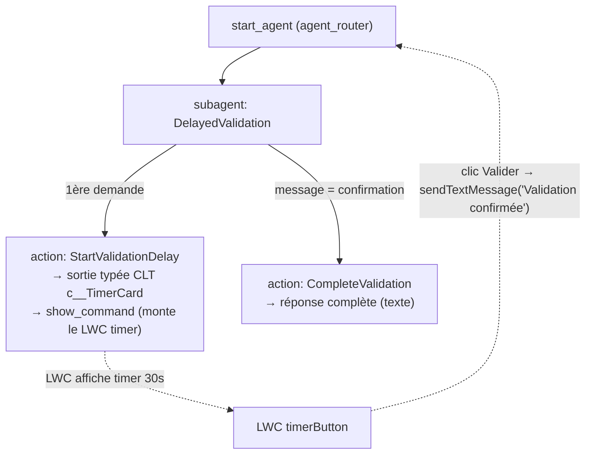

# Agent Spec — AgentscriptUI

> Prototype / proof-of-concept. Objectif : prouver la chaîne
> **question → réponse "délai requis" + LWC timer 30s → clic → action qui répond complètement**
> sur un Employee Agent Agentforce authored en Agent Script.

## 1. Purpose

Démontrer qu'un Employee Agent peut :
1. Répondre à une question en indiquant qu'un **délai de sécurité** est nécessaire.
2. **Afficher un LWC custom** (compte à rebours 30s) directement dans la conversation, via un **Custom Lightning Type (CLT)** rendu en sortie d'action.
3. Une fois le timer épuisé, laisser l'utilisateur **cliquer sur "Valider"** ; le LWC renvoie un message dans la conversation (`configuration.util.sendTextMessage`), ce qui déclenche une **seconde action** qui fournit la réponse complète.

C'est un proto de **mécanique UI**, pas de logique métier. Le scénario est générique et éditable.

## 2. Agent type & environnement

- **Type** : Employee Agent (`AgentforceEmployeeAgent`).
- **Config** : PAS de `default_agent_user`, PAS de `connection messaging:` (règle Employee Agent).
- **Surface de rendu** : `lightningDesktopGenAi` (panneau Agentforce dans Lightning Experience).
- **Org cible** : **FY27** (à authentifier — non connectée à ce jour).
- **API** : 66.0 (CLT nécessite ≥ 64.0 — OK).

> ⚠️ **Contrainte de dev-loop** : un CLT ne s'affiche **que sur un agent publié + activé**.
> Le `sf agent preview` headless renvoie `__supports_result_display__: false` (attendu).
> La validation visuelle du timer se fait dans le **panneau Agentforce de l'org** (ou Agent Builder Preview d'un agent publié).

## 3. Subagent map

## 4. Subagents & actions

### Subagent : `DelayedValidation`
Gère tout le flux à lui seul (proto minimal, pas de hub multi-subagents).

**Instructions (logique) :**
- Si l'utilisateur pose une question / fait une demande **et qu'aucune validation n'est encore en cours** → appeler `StartValidationDelay`, afficher le résultat via `show_command`, et dire que le délai de sécurité de 30 s est requis.
- Si le message de l'utilisateur **indique la confirmation** (déclenché par le clic → texte `"Validation confirmée"`) → appeler `CompleteValidation` et restituer la réponse complète.

**Magic phrases** (fiabiliser le rendu — non-déterminisme `show_command` connu) : mention explicite "The output of this action is always renderable / always use show_command" dans description d'action + description de sortie + instruction du subagent.

### Action : `StartValidationDelay` — **NEEDS STUB** (Apex invocable)
- **Rôle** : renvoyer l'objet qui déclenche l'affichage du LWC timer.
- **Output** : typé CLT `c__TimerCard`, `filter_from_agent: False`, `is_displayable: True`.
  - Champs : `message` (texte affiché au-dessus du timer), `durationSeconds` (int, 30), `confirmLabel` ("Valider").
- **Input** : aucun (ou question brute, ignorée dans le proto).

### Action : `CompleteValidation` — **NEEDS STUB** (Apex invocable)
- **Rôle** : renvoyer la réponse complète après confirmation.
- **Output** : texte simple (réponse finale).
- **Input** : aucun (proto). *(Option future : passer la payload du context event.)*

## 5. Artefacts à produire

| Artefact | Type metadata | Détail |
|---|---|---|
| `TimerCard` | `LightningTypeBundle` (CLT) | `schema.json` (Apex-backed) + `lightningDesktopGenAi/renderer.json` → `c/timerButton` |
| `timerButton` | LWC | target `lightning__AgentforceOutput` + `targetConfigs`/`sourceType name="c__TimerCard"`. Timer 30s corrigé + `handleClick` → `configuration.util.sendTextMessage("Validation confirmée")` |
| `StartValidationDelay` | ApexClass (`@InvocableMethod`) | retourne la structure typée CLT |
| `CompleteValidation` | ApexClass (`@InvocableMethod`) | retourne la réponse complète |
| `AgentscriptUI` | `AiAuthoringBundle` (`.agent`) | routeur + subagent `DelayedValidation` + les 2 actions |

## 6. Retour au clic — décision validée

Le clic **Valider** appelle `configuration.util.sendTextMessage("Validation confirmée")` → envoie un message "au nom de l'utilisateur" → nouveau tour d'agent → route vers `CompleteValidation`.
(Sans context event / payload structurée : choix "message texte" validé pour ce proto.)

> Référence d'implémentation : recette officielle Salesforce
> `trailheadapps/agent-script-recipes → 02_actionConfiguration/customLightningTypes`.
> ⚠️ La façon exacte dont l'objet `configuration` est injecté dans le renderer LWC sera confirmée sur cette recette / la doc officielle "Custom Lightning Type APIs" au moment du build (une réf locale contenait un import erroné à ne pas copier).

## 7. Scénario démo (éditable)

- **User** : « Puis-je valider cette opération sensible ? »
- **Agent** : « Un délai de sécurité de 30 secondes est requis avant validation. » + **[LWC timer 30s]**
- *(30 s plus tard)* user clique **Valider**
- **Agent** : « ✅ Opération validée. Voici le récapitulatif complet : … »

## 8. Plan d'exécution (subagent-driven, après GO + auth FY27)

1. CLT `TimerCard` (schema + renderer) → deploy
2. LWC `timerButton` (timer + handleClick) → deploy
3. Apex `StartValidationDelay` + `CompleteValidation` → deploy
4. Générer le bundle `.agent`, écrire le code, `sf agent validate`
5. Publier + activer (obligatoire pour voir le CLT), tester dans le panneau Agentforce
6. Config accès end-user (Employee agent)
